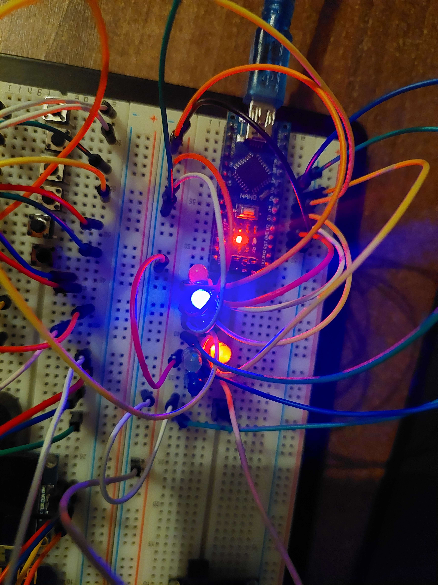

# NanoHraciaKocka
ArduinoNanoHraciaKocka s generovaním náhodného čísla v podobe svetelného zobrazenia.
# Components
1. Arduino Nano
2. 6x LED Diodes (Custom Color)
3. 1x Button
4. Some Wires (13pcs)
5. Bread Board for connecting
# Schematics
- LED 1 --> D2
- LED 2 --> D3
- LED 3 --> D4
- LED 4 --> D5
- LED 5 --> D6
- LED 6 --> D7
- Button 1 --> D8
## Some Images

